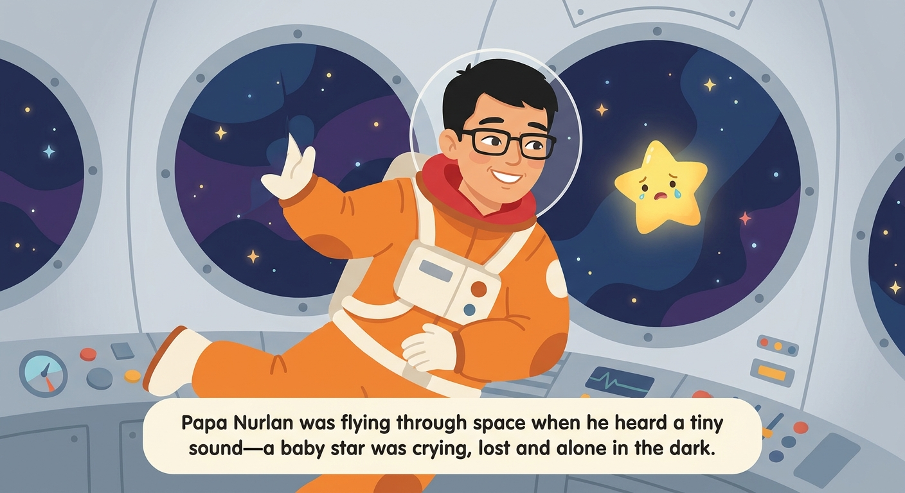
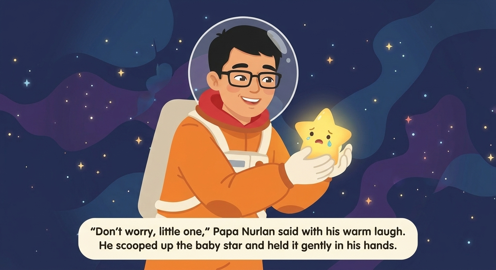
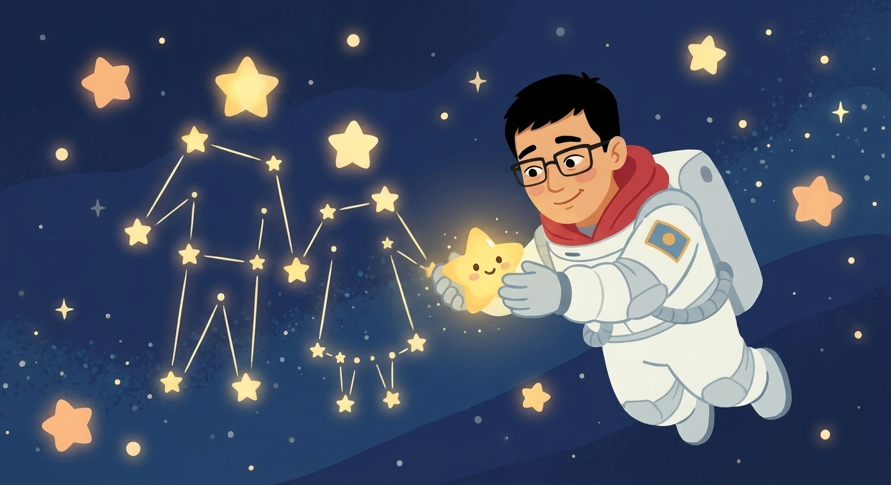

# DadHero

> Turns a child's real life -- their fears, milestones, and memories -- into personalized illustrated stories that grow with them.

Not a comic generator. An agentic **Story Universe companion** built on
**Strands Agents** + **Amazon Bedrock**, for the "Agents for Humans"
(Strands Agents) hackathon, Everyday Agents track. Parents already exist
who describe a theme and get a personalized illustrated book back --
that's table stakes, and DadHero does it well (consistent character art,
lesson hidden in the plot, feedback-driven revision). What isn't table
stakes:

- A **real problem** ("she's scared of school") becomes a goal-oriented
  story, and a **later report** ("she walked in by herself today!") gets
  matched back to that exact story and goal -- Before -> During -> After,
  not a one-shot generation.
- A **real event or memory** ("today he lost his first tooth", "we
  visited grandma last summer") gets preserved and, with permission,
  fictionalized -- imagination added, the real kernel kept -- instead of
  either ignored or replayed literally.
- Every character, place, memory, and lesson accumulates into one
  **Story Universe** per family (`dadhero/memory.py`), so a new story can
  reuse a saved place, avoid repeating a theme, or reference an earlier
  adventure.

## The safety decision this product is built around

Early versions of this idea considered depicting the **child** as the
comic's hero, personalized from an uploaded photo. We deliberately did not
build that: feeding a real minor's photo into a generative image pipeline
is a real child-safety and privacy concern, independent of how the feature
is marketed.

The actual line that matters isn't "never depict a child" -- it's **never
build a character's appearance from a real photo of a real person**. A
benign, text-described child character (name, hair color, a favorite
t-shirt) having an illustrated adventure is the same thing personalized
children's book companies (Wonderbly and similar) have shipped for years
without controversy, because there's no real photo of a real identifiable
person anywhere in the pipeline.

So DadHero supports **any family member as the hero -- including the
child** -- and, since this update, a real **photo upload**, but only under
one rule: a photo may only become a character's likeness for an **adult**
relationship (dad, mom, grandma, uncle, a family friend, yourself). A
child's own **drawing/sketch** can be brought to life regardless of
subject -- it isn't a photographic likeness of a real face, so it carries
none of the same risk.

```
Uploaded photo  + adult relationship  -> save_character_from_photo   OK
Uploaded photo  + child relationship  -> refused, text description asked instead
Uploaded drawing + any relationship   -> stylize_drawing              OK
```

This is enforced twice: `dadhero/agent.py`'s system prompt tells the model
to refuse a child's photo before even considering a tool call, AND
`save_character_from_photo` itself checks `relationship` against a list of
minor-indicating terms (`dadhero/safety.is_minor_relationship`) and refuses
regardless of what the model decided -- a prompt-only rule that's one
jailbreak away from being ignored isn't a safety rule. Verified live: a
message claiming a photo was of "my daughter" was refused before any tool
was even called; the same flow with "my husband" correctly called
`save_character_from_photo` and produced a consistent stylized portrait
across a 2-page story.

**Uploading in the app:** `app.py`'s chat input accepts an attached image
(the 📎 icon). The file is saved to `data/uploads/` and the agent is told
its path in plain text -- the text model never needs to *see* the image
itself; the image *model* (Gemini) is what actually uses it as a
reference when a tool calls `provider.generate(..., reference_image_path=...)`.

## ✅ Status: real image generation is verified and working

**Update:** after resolving a Google Cloud API-key/billing chain (three
separate keys hit three separate walls -- org policy, a project the
account didn't administer, and depleted prepay credit, in that order --
before one finally worked), `GeminiImageProvider` produced real,
consistent, publication-quality art. Two independent test stories confirm
it:

<p float="left">
  
  
  
</p>

Same face, hair, glasses, and suit design across all three pages,
generated from **one locked character description**, each page
conditioned on page 1's image via `reference_image_path` -- nothing here
is hand-picked or touched up. A second story (a gardener rescuing a lost
bunny) confirmed this wasn't a one-off: braid, scarf, and apron stayed
consistent across its pages as well.

The narration is burned directly into each image as a comic-style caption
box (`generate_page_image`'s `caption_text` parameter) instead of shown as
separate text underneath -- Nano Banana renders it cleanly and legibly, so
each page is an actual finished comic panel, not an illustration with a
caption bolted on by the app.

Set `DADHERO_IMAGE_PROVIDER=gemini` with a working `GEMINI_API_KEY` (see
"Getting a working Gemini key" below -- it took three attempts to find a
key/project combination without an infrastructure wall) to reproduce this.
`MockImageProvider` remains the zero-cost default so a fresh checkout with
no API key still runs the full pipeline end-to-end.

### Getting a working Gemini key (learned the hard way)

Not every Google account/project combination works. In order, what
actually blocked each attempt:

1. A key from an org-managed Google Workspace project: `API Keys are
   Disallowed -- Your organization's security policy disallows API keys.`
   -- not fixable by the account holder; the org admin disabled key auth
   entirely.
2. A key from a project the account didn't administer: Google Cloud
   Console's "Enable API" page showed `You need additional access to the
   project` (`resourcemanager.projects.get` missing) -- not this
   account's project to configure.
3. A key from the account's own default **"My First Project"**: worked for
   auth, but `Your prepayment credits are depleted` -- fixed by adding
   credit at https://aistudio.google.com/apikey (NOT the old-style
   `AIzaSy...` key from the Cloud Console credentials wizard -- the working
   key came from AI Studio's own "Create API key" flow, format
   `AQ.Ab8R...`).

Takeaway: use a personal (non-Workspace) Google account, generate the key
directly from **aistudio.google.com/apikey** (not the Cloud Console
credentials wizard), and make sure that project's prepay credit isn't at
zero.

**AWS Bedrock**, separately, is still blocked as of this writing: payment
instrument fixed, then held at a standard post-payment account
verification quota of 0. `DADHERO_MODEL_PROVIDER` defaults to `anthropic`
for this reason -- see StoryMatch's README for the full Bedrock timeline
(same AWS account). Bedrock remains the documented path back for the
actual submission once verification clears.

## Why Gemini "Nano Banana" over Bedrock's image models for this specific job

Bedrock's Titan Image Generator and Stability models support
style-conditioning from a reference image, but Nano Banana
(`gemini-3-pro-image`, and the newer `gemini-3.1-flash-image`) is
specifically built and marketed for keeping **the same subject** consistent
across a multi-turn, edited conversation -- which is the single hardest
technical problem in this product (a comic where "Dad" looks like a
different person on every page fails immediately). If Bedrock access clears
before Gemini access does, Titan Image is the documented fallback path
(same provider-interface pattern -- add a `TitanImageProvider` implementing
`ImageProvider`), at some cost to consistency quality.

## What's built (MVP)

- **`dadhero/models.py`** -- `CharacterBible` (the "Narrative Fingerprint"
  equivalent for this domain: a locked, reusable appearance description)
  and a small library of proven picture-book story shapes
  (`STORY_TEMPLATES`) the agent picks from instead of inventing structure
  from scratch each time.
- **`dadhero/memory.py`** -- local JSON family memory: saved character
  bibles (reuse "Dad the Astronaut" without redescribing him) and a log of
  past story titles/themes.
- **`dadhero/image_providers.py`** -- the `ImageProvider` interface,
  `MockImageProvider` (proven), `GeminiImageProvider` (written,
  unverified -- see Status above).
- **`dadhero/continuity.py`** -- deterministic per-story fact tracking
  (StorySprout's "red backpack on page 1, blue on page 4" problem). Plain
  Python state comparison, not a second LLM call hoping it remembers --
  same philosophy as StoryMatch's evidence verification.
- **`dadhero/safety.py`** -- a real, explainable age-appropriateness screen
  (concerning-term list + length-vs-age heuristic) run on every page's
  text before it's shown, instead of just trusting the model's judgment
  silently.
- **`dadhero/tools.py`** -- 15 Strands `@tool` functions: `save_character`,
  `save_character_from_photo`, `stylize_drawing`, `get_saved_character`,
  `save_place`, `create_story_plan`, `generate_page_image`,
  `check_visual_consistency`, `audit_story_continuity`,
  `get_family_memory`, `check_story_fact`, `check_page_safety`,
  `record_family_memory`, `record_progress`, `record_finished_story`. The
  *creative* planning work (the actual page-by-page outline, mapping the
  parent's intention to a story objective) is still the agent's own
  reasoning -- like StoryMatch's Narrative Fingerprint extraction, there's
  nothing external to call for THAT. `create_story_plan` doesn't do that
  reasoning for it; it records the plan the agent already settled on
  before any image generation starts, the same propose-then-record shape
  `save_character`/`check_story_fact` use -- makes planning a real,
  inspectable checkpoint instead of reasoning that only ever existed
  inside one model response. `check_visual_consistency` is a second,
  independent Gemini vision call judging a generated page against the
  character's reference image (separate from the call that drew it);
  `audit_story_continuity` is a final read-through of every fact
  `check_story_fact` recorded, catching cross-fact inconsistency the
  per-fact check alone can't.
- **`dadhero/agent.py`** -- the Strands `Agent`, Bedrock primary /
  Anthropic fallback (same pattern as StoryMatch), with a system prompt
  encoding the full workflow including the child-safety redirect above.
- **`app.py`** -- Streamlit chat UI. Parses the agent's ``
  image references out of its markdown response and renders each with
  `st.image()` (Streamlit's markdown component can't display local
  filesystem images through that syntax on its own -- it just shows a
  broken-image icon, which is what a first version of this demo actually
  did).
- **`cli_demo.py`** -- terminal fallback with a `--scripted` mode replaying
  a verified real transcript, unattended.
- **`tests/`** -- pytest for everything that doesn't need a live model
  (CharacterBible formatting, memory round-trips, mock image provider,
  agent tool wiring). Run with `python -m pytest tests/ -q`.

## Verified: Before -> During -> After, and real-event -> memory

These are the two mechanics that actually justify calling this a
"companion" instead of a comic generator. Both run for real, Anthropic
API, mock images (image quality is separately proven above -- these
transcripts are about the memory/reasoning layer):

**Before -> During -> After** (two separate agent processes, simulating
different days, sharing only `data/family_memory.json`):

> **Parent (day 1):** "My daughter Aisha (age 6, curly hair, always wears
> her yellow raincoat) has been really scared of going to school lately.
> Can you make a short 3-page comic about her that helps with this?"

The agent produced *"Aisha's Yellow Raincoat Adventure"* and called
`record_finished_story(..., goal="confidence at school")`.

> **Parent (day 2, brand-new process, zero conversation history):**
> "Update: Aisha actually walked into school by herself today without
> crying!"

> **DadHero:** *"That's wonderful! That's a huge step for Aisha — walking
> in by herself without crying is exactly what the Yellow Raincoat story
> was hoping for..."*

It called `get_family_memory` cold, found the earlier goal-oriented story,
and matched the report back to it by name -- with no shared conversation
context, only the persisted Story Universe. `family_memory.json` after
both turns:

```json
"stories": [{"title": "Aisha's Yellow Raincoat Adventure", "goal": "confidence at school", ...}],
"lessons_taught": ["confidence at school"],
"progress": [{"related_to": "Aisha", "update": "...walked into school by herself...", "story_title": "Aisha's Yellow Raincoat Adventure"}]
```

**Real event -> memory -> offered fictionalization:**

> **Parent:** "Today my son Timur (age 5, spiky black hair, loves his blue
> dinosaur backpack) lost his first tooth! It was so exciting."

> **DadHero:** *"What a milestone! ... Would you like me to turn this into
> tonight's story? I could create an adventure where Timur discovers
> something magical about his lost tooth — maybe he becomes a Tooth
> Knight... We'd keep the real moment (the lost tooth!) at the heart of
> it, but add some imagination and fun around it."*

`record_family_memory` fired before the agent even asked permission to
fictionalize it -- the real event is preserved either way, not only if
the parent says yes.

## Verified end-to-end (real transcript, Anthropic API, mock images)

Three-turn conversation, run for real during development:

1. **Parent:** *"My husband Nurlan has short black hair, always wears
   black-framed glasses and a red hoodie, and a big warm laugh. I want a
   5-page comic where he's a brave astronaut who rescues a lost baby star,
   for our 5-year-old daughter Aisha."*
   -> Agent called `get_family_memory` (empty, first time), `save_character`
   (locking in Papa Nurlan's `prompt_fragment`), then `generate_page_image`
   five times -- page 1 with no reference, pages 2-5 each passing page 1's
   `image_path` as `reference_image_path`. Produced a full 5-page story
   with warm, age-appropriate text and (mock) illustrations, and correctly
   labeled them as placeholders rather than claiming they were final art.

2. **Parent:** *"Love it! Page 2 feels a little sad -- can you make the
   baby star look curious instead of scared? Everything else is perfect."*
   -> Agent regenerated **only page 2** (same character fragment, same
   reference image), left pages 1/3/4/5 untouched, and asked if the story
   was ready to save.

3. **Parent:** *"Save this story please!"*
   -> Called `record_finished_story`. Confirmed Papa Nurlan is now saved
   for reuse in future stories without redescribing him.

A second, later verification run tested the child-as-hero path plus the
new continuity/safety tools, from a StorySprout-style *intention* rather
than a plot:

**Parent:** *"My son Arman is 7 and nervous about starting a new school.
Make a funny adventure where he becomes braver and makes a friend. He has
curly brown hair and always wears his favorite green dinosaur t-shirt."*

-> The agent turned "nervous about school" into a treasure-hunt story
where Arman's bravery is *shown* through escalating small challenges
(climbing a tree, crossing a wobbly bridge, calling out to a stranger) --
never a stated moral -- ending with him making a friend, tying his
dinosaur t-shirt into a joke the two new friends bond over. Full tool
trace for the 7-page story:

```
get_family_memory -> save_character
-> check_story_fact x2 -> check_page_safety -> generate_page_image   (page 1)
-> check_page_safety -> generate_page_image                          (page 2)
-> check_story_fact x2 -> check_page_safety -> generate_page_image   (page 3)
-> check_page_safety -> generate_page_image                          (page 4)
-> check_story_fact x2 -> check_page_safety -> generate_page_image   (page 5)
-> check_page_safety -> generate_page_image                          (page 6)
-> check_page_safety -> generate_page_image                          (page 7)
```

22 tool calls for one story -- `check_story_fact` and `check_page_safety`
fire on real pages, not just `generate_page_image` seven times. That
verification density is the actual evidence this is doing agentic work,
not decorating a single prompt.

## Setup

```bash
cd DadHero-Agent
python3 -m venv .venv && source .venv/bin/activate
pip install -r requirements.txt
cp .env.example .env   # edit as needed
```

## Run

`dadhero/agent.py` auto-loads a `.env` file (via `python-dotenv`) if one
exists, so set your real values there once instead of exporting them every
shell session:

```bash
source .venv/bin/activate

# Web demo -- reads provider/keys from .env if present
streamlit run app.py

# Terminal demo
python cli_demo.py                # interactive
python cli_demo.py --scripted     # unattended, matches the transcripts above

# Or override per-invocation without touching .env:
DADHERO_IMAGE_PROVIDER=gemini GEMINI_API_KEY=... streamlit run app.py
DADHERO_MODEL_PROVIDER=anthropic ANTHROPIC_API_KEY=sk-ant-... streamlit run app.py
```

Reset family memory / generated images between demo runs:
`rm -rf data/family_memory.json data/generated_pages`

## What's deliberately not built (cut for time)

- **Voice input** -- Streamlit's `chat_input(accept_audio=True)` and
  Gemini's native audio understanding make this technically reachable
  (Gemini can transcribe + interpret emotional tone from audio in one
  call, no separate STT step), but it adds a real testing surface
  (recording, upload, an extra model call path) for a modality the judged
  reasoning doesn't actually depend on -- the agent's handling of "she's
  upset her friend didn't invite her to play" is the same demonstration
  whether typed or spoken. Documented as the next thing to add, not
  attempted under time pressure.
- Multiple children / multiple simultaneous heroes in one story.
- Export to a shareable PDF/printable comic layout -- pages currently exist
  as separate PNG files plus markdown text, not composited into panels.
- A proper "character sheet" reference-sheet generation step (turnaround
  views) before the first story page -- would likely improve consistency
  further but adds a generation step and cost.
- The Bedrock Titan Image fallback provider mentioned above -- only sketched
  in this README, not implemented.
- A UI "Parent Control Layer" (goal/tone/avoid checkboxes, age slider) --
  the underlying constraints are already respected via plain-text
  instruction (say "avoid scary scenes" and the agent does), just not yet
  exposed as a dedicated sidebar form.

## Pitch (for the submission form)

> Every parent has told their kid a bedtime story where they're the hero.
> DadHero turns that into something real: describe an idea, a worry, or
> just what happened today -- "she's nervous about starting school," "he
> lost his first tooth" -- and it maps that to a story objective, builds a
> consistent illustrated character (any family member, including the
> child, always from a text description or the child's own drawing, never
> a photo of a minor), plans a page-by-page arc that shows the lesson
> instead of stating it, checks its own continuity and age-appropriateness
> on every page, and remembers -- across sessions -- the character, the
> goal, and whether it actually helped.

## Beyond the hackathon: REST API design

`docs/api/` has a designed (not implemented) REST API for a future
platform-with-cabinet rebuild -- `openapi.yaml` (valid OpenAPI 3.1) plus
`design-notes.md` explaining the domain model and every non-obvious
choice (why `/v1/me/...` instead of a family id in the URL, why page
creation is one atomic endpoint instead of exposing the internal
continuity/safety checks, idempotency on the paid-generation calls, etc).

## Credit

The child-safety reframe (adult-hero-by-default, later refined to
photo-vs-drawing) and initial scope were this project's own decisions; the
parent-intention framing, continuity fact-checking, explicit safety-tool
ideas, and the Before -> During -> After / Story Universe / real-event
mechanics were adapted from a teammate's `StorySprout_Hackathon_Idea.md`
design doc, with the photo-based child depiction it proposed deliberately
left out for the reasons above.
